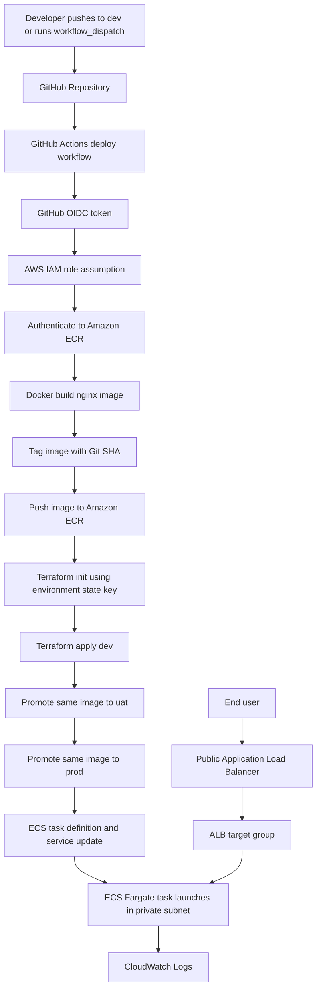
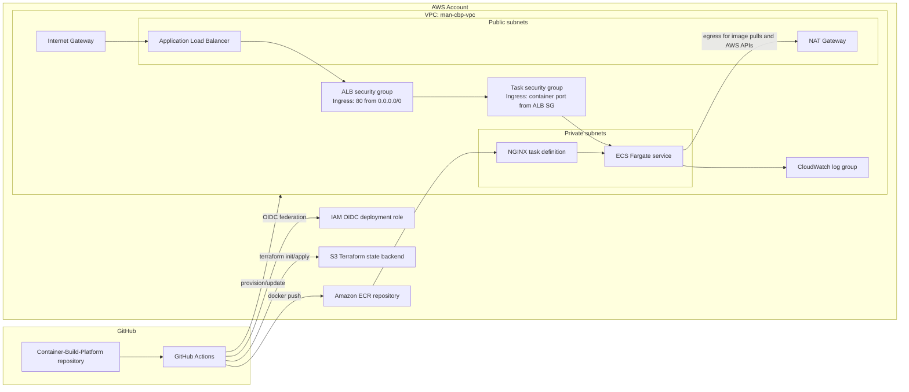
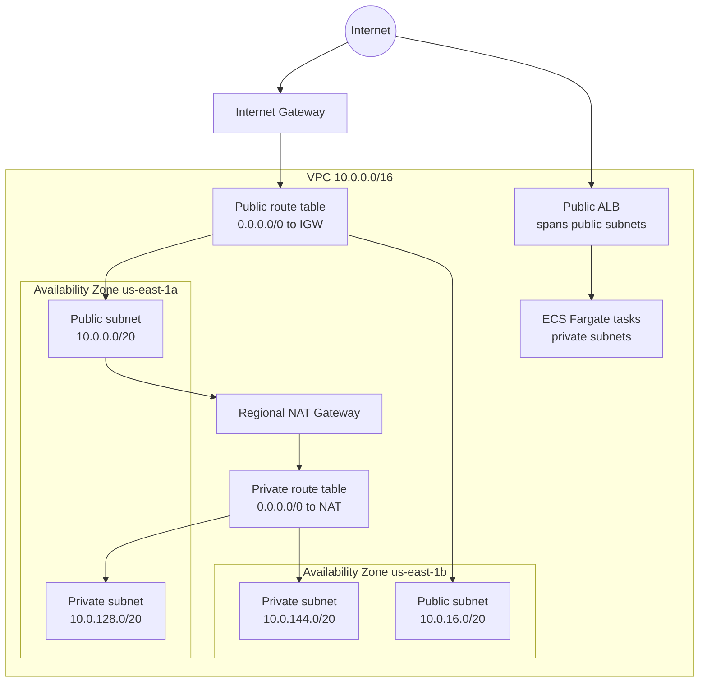

# Container Build Platform

Container Build Platform is a reference DevSecOps deployment pattern for building a container image from GitHub, publishing it to Amazon ECR, and deploying it to Amazon ECS on AWS Fargate behind a public Application Load Balancer.

The repository demonstrates a production-shaped control plane: GitHub Actions uses AWS OIDC federation instead of long-lived access keys, Docker builds an NGINX workload, Terraform manages dev, uat, and prod ECS delivery paths, and the prod `man-cbp` service runs behind an ALB protected by AWS WAF.

## What This Demonstrates

- Keyless GitHub Actions authentication to AWS using OpenID Connect.
- Container build, tag, and push workflow into Amazon ECR.
- Terraform-managed ECS delivery path using an S3 remote backend and import-backed adoption of live resources.
- ECS Fargate service deployment with an ALB target group.
- Custom VPC with public and private subnets across multiple Availability Zones.
- Public ingress is constrained through the ALB security group; ECS task ingress is allowed only from the ALB security group.
- CloudWatch Logs integration for container runtime logs.

## Repository Layout

```text
.
|-- .github/workflows/
|   |-- deploy.yml        # Build, push, and Terraform deploy workflow
|   `-- oidc-debug.yml    # Manual workflow to validate AWS OIDC federation
|-- nginx/
|   |-- Dockerfile        # NGINX container image definition
|   `-- app/index.html    # Static demo workload
`-- terraform/
    |-- backend.tf        # Terraform version, provider, and S3 backend
    |-- main.tf           # VPC, ALB, ECR, ECS, IAM, and CloudWatch resources
    |-- outputs.tf        # ALB, ECR, ECS service, and cluster outputs
    |-- provider.tf       # AWS provider configuration
    |-- terraform.tfvars.example # Safe example for the runtime container image value
    `-- variables.tf      # Configurable deployment inputs
```

## Technologies Used

| Layer | Technology | Purpose |
| --- | --- | --- |
| Source Control | GitHub | Hosts application, Terraform, and CI/CD workflow definitions. |
| CI/CD | GitHub Actions | Builds the container image and executes Terraform deployment. |
| Authentication | GitHub OIDC + AWS IAM | Federates GitHub Actions to AWS without static AWS keys. |
| Container Runtime | Docker | Builds the NGINX application image. |
| Registry | Amazon ECR | Stores versioned container images. |
| Infrastructure as Code | Terraform | Adopts and updates the live `man-cbp` ECS delivery resources. |
| Terraform State | Amazon S3 backend | Stores remote Terraform state for repeatable deployments. |
| Networking | Amazon VPC | Provides public/private subnet isolation and routing. |
| Ingress | Application Load Balancer | Exposes HTTP traffic to the service. |
| Compute | Amazon ECS on Fargate | Runs the container without managing EC2 instances. |
| Logging | Amazon CloudWatch Logs | Captures ECS task logs. |
| Web Server | NGINX Alpine | Lightweight demo container workload. |

## Application Flow Diagram



## Solution Architecture Diagram



## AWS VPC Diagram



## Deployment Flow

1. A commit is pushed to `dev`, or the `Deploy nginx to Fargate` workflow is manually triggered.
2. GitHub Actions requests an OIDC token and assumes the AWS deployment role.
3. The workflow logs in to Amazon ECR.
4. Docker builds the image from `nginx/Dockerfile`.
5. The image is tagged with the Git commit SHA and pushed to ECR.
6. Terraform initializes against the environment-specific S3 backend key from the GitHub Environment variable `TF_STATE_KEY`.
7. Terraform applies dev first, then promotes the same image URI through uat and prod.
8. Dev and uat create isolated environment stacks, while prod updates the existing `man-cbp` stack and WAF-protected ALB.
9. ECS launches the updated NGINX task on Fargate and public users reach the service through the ALB DNS name.

## CI/CD Operating Model

This operating model follows the same production-style structure used in larger GitHub Actions and Terraform AWS projects: establish trust first, bootstrap shared deployment primitives, then let application workflows build immutable artifacts and deploy infrastructure through controlled environment paths.

### Operating Principles

| Principle | Implementation in this project | Production extension |
| --- | --- | --- |
| Keyless AWS access | GitHub Actions assumes AWS IAM roles through OIDC. | Scope trust policies by repository, branch, environment, and workflow. |
| Immutable deploy artifact | Images are tagged with the Git commit SHA. | Promote the same digest across dev, UAT, and production instead of rebuilding. |
| Infrastructure as code | Terraform creates isolated dev and uat stacks and updates the existing prod `man-cbp` stack. | Split networking, platform, and application stacks into separate state files or modules. |
| Remote state | Terraform uses an S3 backend with one state key per GitHub Environment. | Centralize state in a tooling account with encryption, versioning, least-privilege access, and locking. |
| Environment control | The workflow promotes in order: dev -> uat -> prod. | Move each environment into separate AWS accounts when the platform matures. |
| Approval control | GitHub Environments can gate uat and prod before `terraform apply`. | Require protected GitHub Environments and approval gates before production apply. |
| Runtime isolation | ECS task ingress is restricted to the ALB security group. | Disable task public IP assignment, add VPC endpoints, private image pulls, HTTPS-only ingress, and environment-specific CIDRs. |

### Pipeline Stages

```mermaid
flowchart LR
    Commit[Commit or manual dispatch] --> Validate[Static validation]
    Validate --> Auth[Assume AWS role through OIDC]
    Auth --> Build[Build Docker image]
    Build --> Publish[Push image to ECR with Git SHA tag]
    Publish --> Dev[Apply dev]
    Dev --> UATGate[UAT environment approval]
    UATGate --> UAT[Apply uat]
    UAT --> ProdGate[Prod environment approval]
    ProdGate --> Prod[Apply prod]
    Prod --> Verify[ALB, ECS, and CloudWatch verification]
```



### Current Workflow Responsibilities

| Workflow | Trigger | Responsibility | AWS role target |
| --- | --- | --- | --- |
| `.github/workflows/oidc-debug.yml` | Manual only | Validates GitHub-to-AWS OIDC trust by running `aws sts get-caller-identity`. | `GitHubActionsOIDCRole` |
| `.github/workflows/deploy.yml` | Push to `dev` or manual dispatch | Builds the NGINX image once, pushes it to ECR, then applies dev, uat, and prod using GitHub Environment-scoped OIDC roles and Terraform state keys. | `container-build-platform-dev-gha-role`, `container-build-platform-uat-gha-role`, `container-build-platform-prod-gha-role` |

### Environment Promotion Model

The repository is configured for a sequential GitHub Environment promotion model:

| Source | Environment | AWS isolation boundary | Terraform state key | Deployment control |
| --- | --- | --- | --- | --- |
| `dev` branch or manual run | Dev | Dedicated dev VPC and ECS stack | `man-cbp/dev/terraform.tfstate` | Automatic apply after validation. |
| Promotion after dev | UAT | Dedicated uat VPC and ECS stack | `man-cbp/uat/terraform.tfstate` | GitHub Environment approval recommended. |
| Promotion after uat | Prod | Existing `man-cbp` VPC, ALB, ECS, ECR, CloudWatch, and WAF association | `man-cbp/terraform.tfstate` | Protected GitHub Environment approval recommended. |

Each GitHub Environment should define:

| Variable | Example |
| --- | --- |
| `AWS_REGION` | `us-east-1` |
| `AWS_ROLE_ARN` | `arn:aws:iam::866934333672:role/container-build-platform-dev-gha-role` |

The workflow builds the immutable artifact into the existing shared ECR repository `man-cbp/nginx`, then passes that image URI into each environment. Terraform state keys and tfvars files are pinned in the workflow so prod always uses the existing `man-cbp/terraform.tfstate` state unless you intentionally migrate it.

### Recommended Workflow Separation

For a production-grade version, split the current deployment flow into three workflows:

| Workflow | Purpose | Execution order |
| --- | --- | --- |
| `tooling-foundation.yml` | Creates or validates shared CI/CD primitives: Terraform state bucket, state encryption, OIDC provider, and bootstrap role. | Run first during platform bootstrap. |
| `account-bootstrap.yml` | Creates target-account deploy roles, ECR repositories, and environment-specific deployment parameters. | Run after tooling foundation. |
| `app-deploy.yml` | Builds the application image, pushes to ECR, runs Terraform plan/apply, and updates ECS. | Runs continuously from branch or manual deployment events. |

### Governance and Control Points

- Pull requests should run `terraform fmt -check`, `terraform validate`, Docker build validation, and IaC/container security scans before merge.
- `dev`, `uat`, and `prod` should be protected according to the promotion model, with uat and prod using GitHub Environment approvals.
- Production applies should use GitHub Environments with required reviewers.
- The AWS deployment role should be scoped to the repository subject claim and should avoid wildcarding all repositories in the GitHub organization.
- ECR pushes should use Git SHA tags; production should deploy by immutable image digest where possible.
- Terraform state access should be separate from application runtime permissions.
- ECS deployment verification should check service stability, target group health, ALB response, and CloudWatch log ingestion.

### Operational Verification

After each deployment, validate the platform with:

```bash
aws sts get-caller-identity
aws ecr describe-images --repository-name man-cbp/nginx
aws ecs describe-services --cluster man-cbp-cluster --services man-cbp-nginx-service
aws elbv2 describe-target-health --target-group-arn <target-group-arn>
curl -I http://<alb_dns_name>
```

## AWS Resources Provisioned

| Resource | Description |
| --- | --- |
| VPC | Existing DNS-enabled `man-cbp-vpc` using `10.0.0.0/16`. |
| Public subnets | Existing public subnets used by the internet-facing ALB. |
| Private subnets | Existing private subnets `10.0.128.0/20` and `10.0.144.0/20` used by ECS tasks. |
| Internet Gateway | Provides public internet routing for the ALB and NAT Gateway. |
| NAT Gateway | Existing regional NAT Gateway for private route-table egress. |
| Route tables | Separate public and private routing domains. |
| ALB security group | Allows inbound HTTP on port 80 from the public internet. |
| Task security group | Allows inbound container traffic only from the ALB security group. |
| Application Load Balancer | Existing `man-cbp-alb` public HTTP entry point for the NGINX service. |
| Target group | IP-based target group for Fargate tasks. |
| ECR repository | `man-cbp/nginx` stores the NGINX container image with scan-on-push enabled. |
| ECS cluster | `man-cbp-cluster` Fargate cluster with enhanced Container Insights enabled. |
| ECS task definition | Runs the NGINX image with CloudWatch log configuration. |
| ECS service | Maintains the desired task count and registers tasks with the ALB. |
| CloudWatch log group | `/ecs/man-cbp-nginx` stores NGINX container logs with 30-day retention. |
| IAM task execution role | Allows ECS to pull images and write logs. |

## Security Model

- GitHub Actions uses OIDC role assumption, avoiding long-lived AWS access keys in repository secrets.
- ECS tasks are deployed in private subnets, and inbound access is restricted to the ALB security group.
- The task security group accepts inbound traffic only from the ALB security group.
- ALB ingress is intentionally public on HTTP port 80 for demonstration.
- ECR encryption uses AWS-managed AES-256 encryption.
- ECS task logs are centralized in CloudWatch Logs with 30-day retention.
- Terraform state is remote in S3; production deployments should also enforce bucket versioning, encryption, least-privilege state access, and state locking behavior appropriate for the Terraform version in use.

## Prerequisites

- AWS account with permission to provision VPC, ALB, ECR, ECS, IAM, CloudWatch, S3 backend access, and related networking resources.
- GitHub repository OIDC trust configured in AWS IAM for the deployment workflow.
- S3 bucket created for the Terraform backend before `terraform init`.
- Terraform CLI compatible with `required_version` in `terraform/backend.tf`.
- Docker available for local image build testing.
- GitHub Actions workflow role allowed to push ECR images and run Terraform against the target account.

## Required GitHub Actions Configuration

The deployment workflow expects an AWS IAM role that GitHub Actions can assume with:

```yaml
permissions:
  id-token: write
  contents: read
```

For locked-down trust policies, scope each role to this repository and the matching GitHub Environment:

```json
{
  "Condition": {
    "StringEquals": {
      "token.actions.githubusercontent.com:aud": "sts.amazonaws.com",
      "token.actions.githubusercontent.com:sub": "repo:danielblakeman10/Container-Build-Platform:environment:prod"
    }
  }
}
```

Use the broader `repo:danielblakeman10/Container-Build-Platform:*` subject only when you intentionally want multiple branches, tags, or environments to assume the role.

## Local Validation Commands

Run these commands from the repository root.

```bash
docker build -t container-build-platform-nginx:local ./nginx
docker run --rm -p 8080:80 container-build-platform-nginx:local
```

Validate Terraform without touching the remote backend:

```bash
cd terraform
terraform init -backend=false
terraform fmt -check
terraform validate
```

Inspect planned AWS changes when backend and credentials are configured:

```bash
cd terraform
terraform init
terraform plan -var="container_image=<account-id>.dkr.ecr.us-east-1.amazonaws.com/man-cbp/nginx:<tag>"
```

## Demo Script

1. Show the repository structure and highlight that application code, IaC, and CI/CD are version controlled together.
2. Open `.github/workflows/deploy.yml` and explain the OIDC role assumption, ECR login, image build, and Terraform apply stages.
3. Open `terraform/main.tf` and walk through the VPC, ALB, ECR, ECS, IAM, and CloudWatch resources.
4. Trigger the `oidc-debug.yml` workflow to prove AWS federation with `aws sts get-caller-identity`.
5. Trigger the deployment workflow or push to `dev`.
6. Confirm the ECR image was pushed using the Git SHA tag.
7. Confirm the ECS service deployment stabilized.
8. Open the Terraform `alb_dns_name` output in a browser and verify the NGINX page responds.
9. Show CloudWatch Logs for the ECS task.

## Terraform Outputs

| Output | Purpose |
| --- | --- |
| `alb_dns_name` | Public URL target for testing the deployed application. |
| `ecr_repository_url` | Registry URL used by the build pipeline. |
| `ecs_cluster_name` | ECS cluster hosting the service. |
| `ecs_service_name` | ECS service managing the Fargate tasks. |

## Estimated Cost and FinOps Budget

This stack is intentionally small, but it still has real always-on AWS cost drivers. The estimate below assumes `us-east-1`, one ECS Fargate task running 24/7, `512` CPU units, `1024` MiB memory, one public Application Load Balancer, one NAT Gateway, light demo traffic, and a 730-hour month.

| Cost component | Estimated monthly cost | FinOps note |
| --- | ---: | --- |
| ECS Fargate | ~$18 | Based on one Linux/x86 task using `0.5 vCPU` and `1 GB` memory running continuously. |
| Application Load Balancer | ~$22-$30 | Includes ALB hourly cost, light LCU usage, and public IPv4 impact. |
| NAT Gateway | ~$36-$40 | Usually the largest baseline cost because NAT is charged hourly plus per GB processed. |
| Amazon ECR | <$1 | NGINX images are small; cost grows with retained image count and image size. |
| CloudWatch Logs | <$1-$5 | Depends on container log volume and Container Insights metric ingestion. |
| S3 Terraform state | Pennies | Terraform state storage and requests are negligible for this project. |
| Data transfer out | Variable | Internet egress depends on demo traffic volume. |

Expected always-on demo budget:

```text
Approximate monthly range: $85-$100
```

If this environment is only needed for demos, the strongest cost control is scheduled teardown. Running the stack for 40 hours/month instead of continuously can reduce the active infrastructure cost dramatically, especially for NAT Gateway, ALB, and Fargate.

### Primary Cost Drivers

- NAT Gateway: persistent hourly charge plus data processing charge.
- Application Load Balancer: hourly charge plus LCU usage.
- Public IPv4: hourly charge for public IPv4 addresses associated with AWS resources.
- Fargate runtime: proportional to task CPU, memory, and running hours.
- CloudWatch Logs: proportional to ingestion, retention, and Container Insights usage.

### FinOps Controls

- Add consistent tags such as `Project`, `Environment`, `Owner`, `CostCenter`, and `ManagedBy`.
- Create AWS Budgets alerts at `$25`, `$50`, and `$100` monthly thresholds.
- Add ECR lifecycle policies to expire stale image tags and untagged images.
- Keep ECS desired count at `1` for demo environments.
- Destroy non-production infrastructure when not actively demonstrating the platform.
- Add VPC endpoints for ECR, CloudWatch Logs, and S3 if NAT Gateway data processing becomes material.
- Group Cost Explorer views by service and project tags.
- Separate dev, UAT, and production state keys or accounts before scaling this pattern.

Recommended demo talk track:

```text
The platform is intentionally small, but it still demonstrates real FinOps tradeoffs. At this scale, Fargate is not the dominant cost driver; the persistent network edge components are. NAT Gateway and ALB create most of the baseline monthly cost, so the operating model uses tagging, budget alerts, lifecycle policies, VPC endpoint evaluation, and teardown automation for non-production environments.
```

## Production Hardening Opportunities

- Add HTTPS listener, ACM certificate, and HTTP-to-HTTPS redirect on the ALB.
- Restrict ALB ingress CIDRs if the service is not intended to be public.
- Add ECR image scanning, lifecycle policies, and immutable tags.
- Replace single NAT Gateway with one NAT Gateway per AZ if higher availability is required.
- Add VPC endpoints for ECR, CloudWatch Logs, and S3 to reduce NAT dependency and egress cost.
- Split Terraform into modules when the project grows beyond a single service.
- Add Terraform plan review gates for pull requests before promotion.
- Add container vulnerability scanning and IaC scanning in CI.
- Add ECS deployment circuit breaker and health-check tuned rollback behavior.
- Parameterize environment names for dev/stage/prod isolation.
